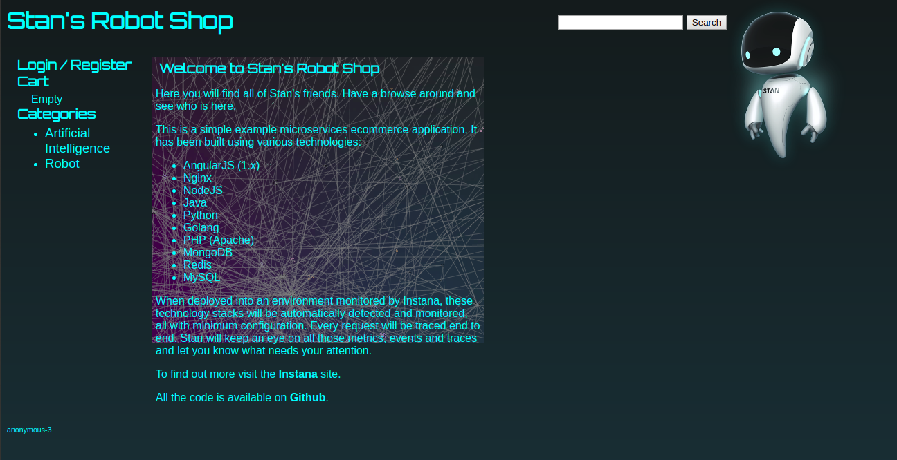

# Deploying a Microservice Application to Kubernetes

In this repository, I have deployed a sample microservice application called Stan's Robot Shop. This is an open-source sample microservice app made by <a href="https://www.instana.com/">Instana.</a>


<h2> Attribution </h2>

Hello everyone, you are welcome to make use of this repository and learn from it but please do not copy without giving attribution to the author.

<h2> Microservices </h2>

Microservices are small and independent services that work together to form a whole application. Traditionally, apps use a monolithic architecture. In monolithic architecture, all features and services are part of one layer application but a microservice architecture breaks an application up into a collection of small loosely-coupled service.

Microservices are small - each microservice implements only a small piece of an application's overall functionality. Microservices interact with each other using stable and well defined APIs. As each of the service has its own codebase and a separate running process therefore <b> they can be scaled separately </b>.

<p align="center">
  
</p>

<h4> 1. Cloning the robot-shop git repo </h4>

Switching to home directory.

```javascript
cd ~
```


Cloning robot-shop git repository. This repository contains ready-made YAML files that we can use to quickly and easy install the application.

```javascript
git clone https://github.com/linuxacademy/robot-shop.git
```


<h4> 2. Changing directory and going where all the YAML files are present </h4>

```javascript
cd robot-shop
cd K8s
cd descriptors
```


<h4> 3. Listing out the YAML files </h4>

```javascript
ls
```


<h4> 4. Creating a namespace called robot-shop </h4>

```javascript
kubectl create namespace robot-shop
```


<h4> 5. Installing the app </h4>

Installing all the YAML files present under descriptors directory and installing the app under robot-shop namespace.

```javascript
kubectl -n robot-shop create -f ~/robot-shop/K8s/descriptors/
```


<h4> 6. Opening the app on the browser </h4>

Grabbing the master node public IP address and pasting it in the URL along with the port number 30080.

```javascript
http://public_server_ip:30080
```

